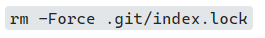

# Class Notes

> Here is where I will enter general notes from my classes, including check-lists for my **practice homework** as well as **questions** I have for each upcoming class.

## Week 1 | Day 1

Remember to write the complete `git commit` command with the message:

```ps
git commit -m "Some commit message"
```

If I forget, and get git locked up on me, I can fix it in Windows with the following.



I can show an image by using the following markdown syntax.

```markdown

```

